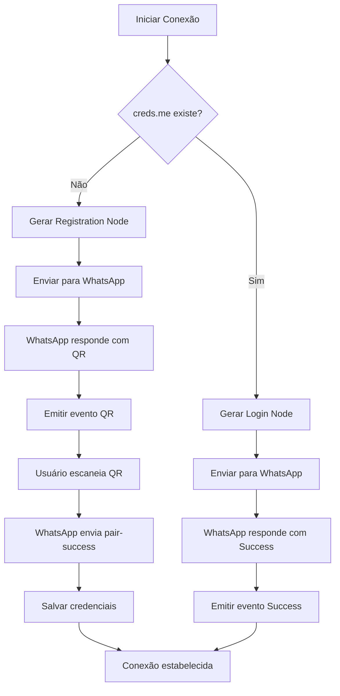

# Ciclo de Vida da Conexão WhatsApp com Baileys

## Visão Geral

O processo de conexão com WhatsApp através do Baileys segue um ciclo de vida bem definido, onde diferentes componentes são criados e gerenciados em cada etapa. Este documento detalha exatamente o que é criado em cada fase e quando o QR Code é necessário.

## Etapas do Ciclo de Vida

### 1. **Inicialização (Initialization)**

#### O que é criado:
```typescript
// 1.1. Credenciais de Autenticação
const creds: AuthenticationCreds = {
    noiseKey: Curve.generateKeyPair(),                    // Par de chaves para Noise Protocol
    pairingEphemeralKeyPair: Curve.generateKeyPair(),    // Chaves temporárias para pareamento
    signedIdentityKey: identityKey,                       // Chave de identidade assinada
    signedPreKey: signedKeyPair(identityKey, 1),         // Pre-key assinada
    registrationId: generateRegistrationId(),             // ID de registro único
    advSecretKey: randomBytes(32).toString('base64'),    // Chave secreta de anúncio
    processedHistoryMessages: [],                         // Mensagens processadas
    nextPreKeyId: 1,                                      // Próximo ID de pre-key
    firstUnuploadedPreKeyId: 1,                          // Primeiro pre-key não enviado
    accountSyncCounter: 0,                                // Contador de sincronização
    accountSettings: { unarchiveChats: false },          // Configurações da conta
    registered: false,                                    // Status de registro
    pairingCode: undefined,                              // Código de pareamento
    lastPropHash: undefined,                             // Hash da última propriedade
    routingInfo: undefined                               // Informações de roteamento
}

// 1.2. Estado de Autenticação
const authState: AuthenticationState = {
    creds: creds,
    keys: makeCacheableSignalKeyStore(state.keys, logger)  // Store de chaves com cache
}

// 1.3. Configuração do Socket
const config: SocketConfig = {
    version: [2, 3000, 1023223821],
    browser: Browsers.ubuntu('Chrome'),
    waWebSocketUrl: 'wss://web.whatsapp.com/ws/chat',
    connectTimeoutMs: 20000,
    keepAliveIntervalMs: 30000,
    logger: logger,
    auth: authState,
    // ... outras configurações
}
```

#### Componentes criados:
- **Chaves criptográficas**: Noise key, identity key, pre-keys
- **ID de registro**: Número único para identificar o dispositivo
- **Store de chaves**: Sistema de armazenamento de chaves criptográficas
- **Configuração**: Parâmetros de conexão e comportamento

### 2. **Criação do Socket (Socket Creation)**

#### O que é criado:
```typescript
// 2.1. Par de chaves efêmeras
const ephemeralKeyPair = Curve.generateKeyPair()

// 2.2. Handler de Noise Protocol
const noise = makeNoiseHandler({
    keyPair: ephemeralKeyPair,
    NOISE_HEADER: NOISE_WA_HEADER,
    logger,
    routingInfo: authState?.creds?.routingInfo
})

// 2.3. Cliente WebSocket
const ws = new WebSocketClient(url, config)

// 2.4. Repositório de Sinal
const signalRepository = makeSignalRepository({ creds, keys }, logger, pnFromLIDUSync)

// 2.5. Buffer de Eventos
const ev = makeEventBuffer(logger)

// 2.6. Chaves com capacidade de transação
const keys = addTransactionCapability(authState.keys, logger, transactionOpts)
```

#### Componentes criados:
- **WebSocket Client**: Cliente para comunicação com WhatsApp
- **Noise Handler**: Gerenciador de protocolo de segurança
- **Signal Repository**: Repositório para chaves criptográficas
- **Event Buffer**: Buffer para processamento de eventos
- **Transaction Keys**: Chaves com capacidade de transação

### 3. **Estabelecimento da Conexão (Connection Establishment)**

#### O que é criado:
```typescript
// 3.1. Conexão WebSocket
ws.connect()

// 3.2. Handshake inicial
const helloMsg: proto.IHandshakeMessage = {
    clientHello: { ephemeral: ephemeralKeyPair.public }
}
```

#### Processo:
1. **Conexão WebSocket**: Estabelece conexão TCP com servidor WhatsApp
2. **Handshake**: Troca de chaves públicas para estabelecer canal seguro
3. **Validação**: Verificação da conexão e preparação para autenticação

### 4. **Processo de Autenticação (Authentication Process)**

#### 4.1. **Primeira Conexão (QR Code Necessário)**

**Momento do QR Code**: Após o handshake, quando `!creds.me` (usuário não está logado)

```typescript
// 4.1.1. Nó de Registro
const node = generateRegistrationNode(creds, config)

// 4.1.2. Payload de Registro
const registerPayload: proto.IClientPayload = {
    ...getClientPayload(config),
    passive: true,
    pull: false,
    devicePairingData: {
        buildHash: appVersionBuf,           // Hash MD5 da versão
        deviceProps: companionProto,        // Propriedades do dispositivo
        eRegid: encodeBigEndian(registrationId),  // ID de registro
        eKeytype: KEY_BUNDLE_TYPE,          // Tipo de chave
        eIdent: signedIdentityKey.public,   // Chave de identidade
        eSkeyId: encodeBigEndian(signedPreKey.keyId, 3),  // ID da pre-key
        eSkeyVal: signedPreKey.keyPair.public,            // Valor da pre-key
        eSkeySig: signedPreKey.signature                  // Assinatura da pre-key
    }
}
```

**O que é criado durante o QR Code**:
- **Nó de Registro**: Dados do dispositivo para pareamento
- **QR Code**: String contendo referência, chaves e dados de pareamento
- **Evento de QR**: `connection.update` com `qr` contendo o código

```typescript
// 4.1.3. Geração do QR Code
const qr = [ref, noiseKeyB64, identityKeyB64, advB64].join(',')

// 4.1.4. Emissão do evento
ev.emit('connection.update', { qr })
```

#### 4.2. **Pareamento Bem-sucedido (Pair Success)**

**O que é criado após escaneamento do QR**:
```typescript
// 4.2.1. Identidade do Dispositivo
const identity = createSignalIdentity(lid!, accountSignatureKey!)

// 4.2.2. Atualização de Credenciais
const authUpdate: Partial<AuthenticationCreds> = {
    account,                                    // Conta do dispositivo
    me: { id: jid!, name: bizName, lid },      // Informações do usuário
    signalIdentities: [...(signalIdentities || []), identity],  // Identidades de sinal
    platform: platformNode?.attrs.name        // Plataforma
}

// 4.2.3. Resposta de Pareamento
const reply: BinaryNode = {
    tag: 'iq',
    attrs: { to: S_WHATSAPP_NET, type: 'result', id: msgId! },
    content: [{
        tag: 'pair-device-sign',
        attrs: {},
        content: [{
            tag: 'device-identity',
            attrs: { 'key-index': deviceIdentity.keyIndex!.toString() },
            content: accountEnc
        }]
    }]
}
```

#### 4.3. **Conexão Existente (Sem QR Code)**

**Momento**: Quando `creds.me` existe (usuário já está logado)

```typescript
// 4.3.1. Nó de Login
const node = generateLoginNode(creds.me.id, config)

// 4.3.2. Payload de Login
const payload: proto.IClientPayload = {
    ...getClientPayload(config),
    passive: true,
    pull: true,
    username: +user,        // Número do usuário
    device: device,         // ID do dispositivo
    lidDbMigrated: false    // Status de migração LID
}
```

### 5. **Pós-Autenticação (Post-Authentication)**

#### O que é criado após login bem-sucedido:

```typescript
// 5.1. Upload de Pre-keys
await uploadPreKeysToServerIfRequired()

// 5.2. Pre-keys geradas
const preKeys = await getNextPreKeysNode({ creds, keys }, count)

// 5.3. Sessão LID (se aplicável)
if (node.attrs.lid && authState.creds.me?.id) {
    const myLID = node.attrs.lid
    const myPN = authState.creds.me!.id
    
    // Mapeamento LID-PN
    await signalRepository.lidMapping.storeLIDPNMappings([{ lid: myLID, pn: myPN }])
    
    // Lista de dispositivos
    await authState.keys.set({
        'device-list': {
            [user]: [device?.toString() || '0']
        }
    })
    
    // Migração de sessão
    await signalRepository.migrateSession(myPN, myLID)
}

// 5.4. Keep Alive
const keepAliveReq = setInterval(() => {
    // Enviar ping para manter conexão viva
}, keepAliveIntervalMs)
```

#### Componentes criados:
- **Pre-keys**: Chaves temporárias para criptografia
- **Sessão LID**: Sessão com Local ID
- **Mapeamento LID-PN**: Mapeamento entre Local ID e Phone Number
- **Keep Alive**: Timer para manter conexão ativa
- **Device List**: Lista de dispositivos do usuário

### 6. **Estado Conectado (Connected State)**

#### O que é criado durante operação normal:

```typescript
// 6.1. Processamento de Mensagens
const onMessageReceived = (data: Buffer) => {
    noise.decodeFrame(data, frame => {
        // Processar frame decodificado
        ws.emit('frame', frame)
    })
}

// 6.2. Event Handlers
ws.on('CB:success', async (node: BinaryNode) => {
    // Login completo
    ev.emit('connection.update', { connection: 'open' })
})

// 6.3. Cache de Mídia (se configurado)
const mediaCache = new NodeCache()

// 6.4. Cache de Retry (se configurado)
const msgRetryCounterCache = new NodeCache()
```

## Quando o QR Code é Necessário?

### ✅ **QR Code É NECESSÁRIO quando:**

1. **Primeira conexão** (`!creds.me`):
   - Usuário nunca conectou antes
   - Não existem credenciais salvas
   - Dispositivo não está registrado

2. **Credenciais inválidas**:
   - Credenciais corrompidas
   - Token expirado
   - Chaves inválidas

3. **Logout forçado**:
   - Usuário fez logout manual
   - Servidor invalidou sessão
   - `DisconnectReason.loggedOut`

### ❌ **QR Code NÃO é necessário quando:**

1. **Reconexão normal**:
   - Credenciais válidas existem
   - Conexão temporariamente perdida
   - Reconexão automática

2. **Conexão existente**:
   - `creds.me` existe
   - Usuário já está registrado
   - Sessão válida

## Fluxo de Decisão do QR Code



## Estrutura de Dados Criada

### Durante Inicialização:
```typescript
interface AuthenticationCreds {
    noiseKey: KeyPair                    // Chaves para Noise Protocol
    pairingEphemeralKeyPair: KeyPair    // Chaves temporárias de pareamento
    signedIdentityKey: KeyPair          // Chave de identidade assinada
    signedPreKey: SignedKeyPair         // Pre-key assinada
    registrationId: number              // ID único de registro
    advSecretKey: string                // Chave secreta de anúncio
    processedHistoryMessages: number[]  // Mensagens processadas
    nextPreKeyId: number                // Próximo ID de pre-key
    firstUnuploadedPreKeyId: number     // Primeiro pre-key não enviado
    accountSyncCounter: number          // Contador de sincronização
    accountSettings: AccountSettings    // Configurações da conta
    registered: boolean                 // Status de registro
    pairingCode?: string                // Código de pareamento
    lastPropHash?: string               // Hash da última propriedade
    routingInfo?: Buffer                // Informações de roteamento
}
```

### Durante Pareamento:
```typescript
interface DeviceAccount {
    account: proto.IADVSignedDeviceIdentity  // Conta do dispositivo
    me: { id: string, name: string, lid?: string }  // Informações do usuário
    signalIdentities: SignalIdentity[]       // Identidades de sinal
    platform?: string                        // Plataforma
}
```

### Durante Operação:
```typescript
interface ConnectionState {
    connection: 'connecting' | 'open' | 'close'
    lastDisconnect?: {
        error: Error
        date: Date
    }
    qr?: string                            // QR Code (quando necessário)
    receivedPendingNotifications?: boolean // Notificações pendentes
    isNewLogin?: boolean                   // Novo login
}
```

## Resumo das Etapas

| Etapa | O que é criado | QR Code necessário? |
|-------|----------------|-------------------|
| **Inicialização** | Chaves criptográficas, credenciais, configuração | ❌ |
| **Criação do Socket** | WebSocket client, Noise handler, Signal repository | ❌ |
| **Estabelecimento** | Conexão TCP, handshake inicial | ❌ |
| **Autenticação** | Nó de registro/login, payload de autenticação | ✅ (primeira vez) |
| **Pareamento** | Identidade do dispositivo, credenciais atualizadas | ✅ (após QR) |
| **Pós-Autenticação** | Pre-keys, sessão LID, keep alive | ❌ |
| **Estado Conectado** | Processadores de mensagem, caches, handlers | ❌ |

O QR Code é essencial apenas na **primeira conexão** ou quando as **credenciais são inválidas**. Em todas as outras situações, o Baileys pode reconectar automaticamente usando as credenciais salvas.