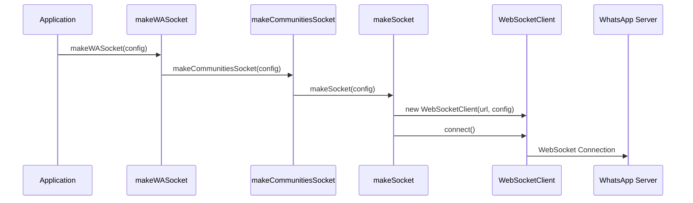
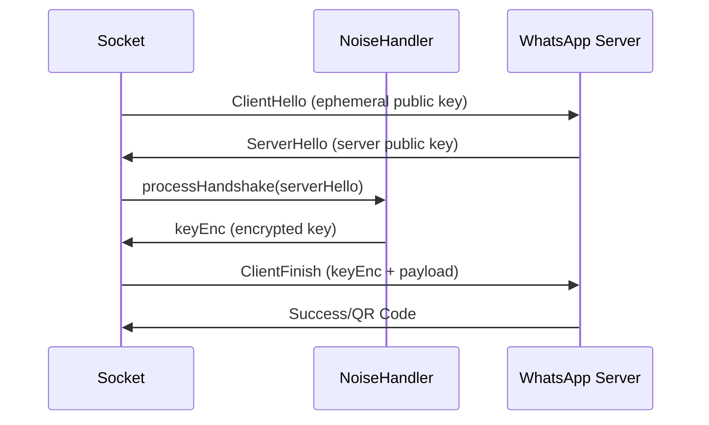
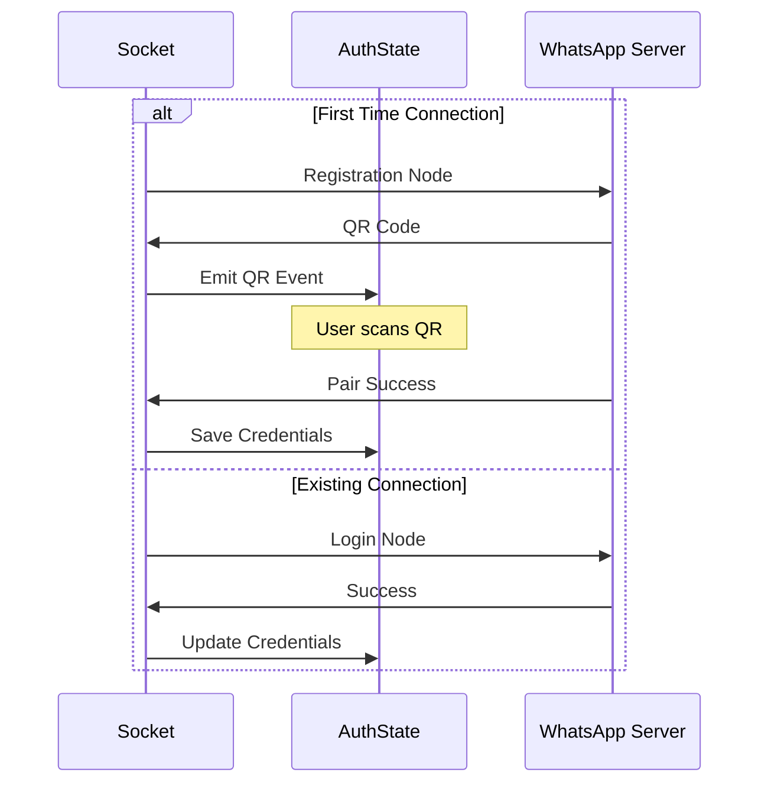

# Conexão WhatsApp com Baileys - Documentação Técnica

## Arquitetura do Sistema

### Visão Geral da Arquitetura

O Baileys implementa uma arquitetura em camadas para gerenciar a conexão com o WhatsApp Web:

```
┌─────────────────────────────────────────────────────────────┐
│                    makeWASocket()                          │
│                  (Entry Point)                             │
└─────────────────────┬───────────────────────────────────────┘
                      │
┌─────────────────────▼───────────────────────────────────────┐
│              makeCommunitiesSocket()                       │
│              (Communities Layer)                           │
└─────────────────────┬───────────────────────────────────────┘
                      │
┌─────────────────────▼───────────────────────────────────────┐
│                  makeSocket()                              │
│              (Core Socket Layer)                           │
└─────────────────────┬───────────────────────────────────────┘
                      │
        ┌─────────────┼─────────────┐
        │             │             │
┌───────▼──────┐ ┌───▼────┐ ┌──────▼──────┐
│WebSocketClient│ │NoiseHandler│ │SignalRepository│
│   (Transport) │ │ (Security) │ │  (Crypto)     │
└───────────────┘ └──────────┘ └───────────────┘
```

## Classes e Interfaces Principais

### 1. makeWASocket (Entry Point)

**Localização**: `src/Socket/index.ts`

```typescript
const makeWASocket = (config: UserFacingSocketConfig) => {
    const newConfig = {
        ...DEFAULT_CONNECTION_CONFIG,
        ...config
    }
    
    if (config.shouldSyncHistoryMessage === undefined) {
        newConfig.shouldSyncHistoryMessage = () => !!newConfig.syncFullHistory
    }
    
    return makeCommunitiesSocket(newConfig)
}
```

**Responsabilidades**:
- Configuração inicial do socket
- Aplicação de configurações padrão
- Delegar para a camada de comunidades

### 2. makeSocket (Core Socket)

**Localização**: `src/Socket/socket.ts`

```typescript
export const makeSocket = (config: SocketConfig) => {
    // Inicialização de componentes
    const ephemeralKeyPair = Curve.generateKeyPair()
    const noise = makeNoiseHandler({...})
    const ws = new WebSocketClient(url, config)
    const signalRepository = makeSignalRepository({...})
    
    // Handlers de eventos
    ws.on('open', async () => {
        await validateConnection()
    })
    
    // Retorna interface do socket
    return {
        type: 'md' as 'md',
        ws,
        ev,
        authState: { creds, keys },
        signalRepository,
        // ... outros métodos
    }
}
```

**Responsabilidades**:
- Gerenciamento da conexão WebSocket
- Handshake e autenticação
- Processamento de mensagens
- Gerenciamento de estado

### 3. WebSocketClient

**Localização**: `src/Socket/Client/websocket.ts`

```typescript
export class WebSocketClient extends AbstractSocketClient {
    protected socket: WebSocket | null = null
    
    get isOpen(): boolean {
        return this.socket?.readyState === WebSocket.OPEN
    }
    
    async connect(): Promise<void> {
        this.socket = new WebSocket(this.url, {
            origin: DEFAULT_ORIGIN,
            headers: this.config.options?.headers as {},
            handshakeTimeout: this.config.connectTimeoutMs,
            timeout: this.config.connectTimeoutMs,
            agent: this.config.agent
        })
        
        // Configurar event listeners
        const events = ['close', 'error', 'upgrade', 'message', 'open', 'ping', 'pong']
        for (const event of events) {
            this.socket?.on(event, (...args: any[]) => this.emit(event, ...args))
        }
    }
}
```

**Responsabilidades**:
- Gerenciamento da conexão WebSocket nativa
- Encapsulamento de estados de conexão
- Propagação de eventos

### 4. AbstractSocketClient

**Localização**: `src/Socket/Client/types.ts`

```typescript
export abstract class AbstractSocketClient extends EventEmitter {
    abstract get isOpen(): boolean
    abstract get isClosed(): boolean
    abstract get isClosing(): boolean
    abstract get isConnecting(): boolean
    
    constructor(
        public url: URL,
        public config: SocketConfig
    ) {
        super()
        this.setMaxListeners(0)
    }
    
    abstract connect(): Promise<void>
    abstract close(): Promise<void>
    abstract send(str: Uint8Array | string, cb?: (err?: Error) => void): boolean
}
```

**Responsabilidades**:
- Interface base para clientes de socket
- Definição de contratos abstratos
- Gerenciamento de eventos

## Fluxo de Conexão Detalhado

### 1. Inicialização



### 2. Processo de Handshake



### 3. Autenticação



## Métodos Principais

### 1. Conexão e Desconexão

#### `connect()`
```typescript
async connect(): Promise<void> {
    if (this.socket) {
        return
    }
    
    this.socket = new WebSocket(this.url, {
        origin: DEFAULT_ORIGIN,
        headers: this.config.options?.headers as {},
        handshakeTimeout: this.config.connectTimeoutMs,
        timeout: this.config.connectTimeoutMs,
        agent: this.config.agent
    })
    
    // Configurar event listeners
    const events = ['close', 'error', 'upgrade', 'message', 'open', 'ping', 'pong']
    for (const event of events) {
        this.socket?.on(event, (...args: any[]) => this.emit(event, ...args))
    }
}
```

#### `end()`
```typescript
const end = (error: Error | undefined) => {
    if (closed) {
        logger.trace({ trace: error?.stack }, 'connection already closed')
        return
    }
    
    closed = true
    logger.info({ trace: error?.stack }, error ? 'connection errored' : 'connection closed')
    
    clearInterval(keepAliveReq)
    clearTimeout(qrTimer)
    
    ws.removeAllListeners('close')
    ws.removeAllListeners('open')
    ws.removeAllListeners('message')
    
    if (!ws.isClosed && !ws.isClosing) {
        try {
            ws.close()
        } catch {}
    }
    
    ev.emit('connection.update', {
        connection: 'close',
        lastDisconnect: {
            error,
            date: new Date()
        }
    })
}
```

#### `logout()`
```typescript
const logout = async (msg?: string) => {
    const jid = authState.creds.me?.id
    if (jid) {
        await sendNode({
            tag: 'iq',
            attrs: {
                to: S_WHATSAPP_NET,
                type: 'set',
                id: generateMessageTag(),
                xmlns: 'md'
            },
            content: [
                {
                    tag: 'remove-companion-device',
                    attrs: {
                        jid,
                        reason: 'user_initiated'
                    }
                }
            ]
        })
    }
    
    end(new Boom(msg || 'Intentional Logout', { statusCode: DisconnectReason.loggedOut }))
}
```

### 2. Validação de Conexão

#### `validateConnection()`
```typescript
const validateConnection = async () => {
    let helloMsg: proto.IHandshakeMessage = {
        clientHello: { ephemeral: ephemeralKeyPair.public }
    }
    helloMsg = proto.HandshakeMessage.fromObject(helloMsg)
    
    logger.info({ browser, helloMsg }, 'connected to WA')
    
    const init = proto.HandshakeMessage.encode(helloMsg).finish()
    const result = await awaitNextMessage<Uint8Array>(init)
    const handshake = proto.HandshakeMessage.decode(result)
    
    logger.trace({ handshake }, 'handshake recv from WA')
    
    const keyEnc = await noise.processHandshake(handshake, creds.noiseKey)
    
    let node: proto.IClientPayload
    if (!creds.me) {
        node = generateRegistrationNode(creds, config)
        logger.info({ node }, 'not logged in, attempting registration...')
    } else {
        node = generateLoginNode(creds.me.id, config)
        logger.info({ node }, 'logging in...')
    }
    
    const payloadEnc = noise.encrypt(proto.ClientPayload.encode(node).finish())
    await sendRawMessage(
        proto.HandshakeMessage.encode({
            clientFinish: {
                static: keyEnc,
                payload: payloadEnc
            }
        }).finish()
    )
    noise.finishInit()
    startKeepAliveRequest()
}
```

### 3. Gerenciamento de PreKeys

#### `uploadPreKeys()`
```typescript
const uploadPreKeys = async (count = INITIAL_PREKEY_COUNT, retryCount = 0) => {
    // Check minimum interval (except for retries)
    if (retryCount === 0) {
        const timeSinceLastUpload = Date.now() - lastUploadTime
        if (timeSinceLastUpload < MIN_UPLOAD_INTERVAL) {
            logger.debug(`Skipping upload, only ${timeSinceLastUpload}ms since last upload`)
            return
        }
    }
    
    // Prevent multiple concurrent uploads
    if (uploadPreKeysPromise) {
        logger.debug('Pre-key upload already in progress, waiting for completion')
        return uploadPreKeysPromise
    }
    
    const uploadLogic = async () => {
        logger.info({ count, retryCount }, 'uploading pre-keys')
        
        // Generate and save pre-keys atomically
        const node = await keys.transaction(async () => {
            logger.debug({ requestedCount: count }, 'generating pre-keys with requested count')
            const { update, node } = await getNextPreKeysNode({ creds, keys }, count)
            ev.emit('creds.update', update)
            return node
        }, creds?.me?.id || 'upload-pre-keys')
        
        // Upload to server
        try {
            await query(node)
            logger.info({ count }, 'uploaded pre-keys successfully')
            lastUploadTime = Date.now()
        } catch (uploadError) {
            logger.error({ uploadError, count }, 'Failed to upload pre-keys to server')
            
            // Exponential backoff retry
            if (retryCount < 3) {
                const backoffDelay = Math.min(1000 * Math.pow(2, retryCount), 10000)
                logger.info(`Retrying pre-key upload in ${backoffDelay}ms`)
                await new Promise(resolve => setTimeout(resolve, backoffDelay))
                return uploadPreKeys(count, retryCount + 1)
            }
            
            throw uploadError
        }
    }
    
    // Add timeout protection
    uploadPreKeysPromise = Promise.race([
        uploadLogic(),
        new Promise<void>((_, reject) =>
            setTimeout(() => reject(new Boom('Pre-key upload timeout', { statusCode: 408 })), UPLOAD_TIMEOUT)
        )
    ])
    
    try {
        await uploadPreKeysPromise
    } finally {
        uploadPreKeysPromise = null
    }
}
```

### 4. Processamento de Mensagens

#### `onMessageReceived()`
```typescript
const onMessageReceived = (data: Buffer) => {
    noise.decodeFrame(data, frame => {
        // reset ping timeout
        lastDateRecv = new Date()
        
        let anyTriggered = false
        
        anyTriggered = ws.emit('frame', frame)
        // if it's a binary node
        if (!(frame instanceof Uint8Array)) {
            const msgId = frame.attrs.id
            
            if (logger.level === 'trace') {
                logger.trace({ xml: binaryNodeToString(frame), msg: 'recv xml' })
            }
            
            /* Check if this is a response to a message we sent */
            anyTriggered = ws.emit(`${DEF_TAG_PREFIX}${msgId}`, frame) || anyTriggered
            /* Check if this is a response to a message we are expecting */
            const l0 = frame.tag
            const l1 = frame.attrs || {}
            const l2 = Array.isArray(frame.content) ? frame.content[0]?.tag : ''
            
            for (const key of Object.keys(l1)) {
                anyTriggered = ws.emit(`${DEF_CALLBACK_PREFIX}${l0},${key}:${l1[key]},${l2}`, frame) || anyTriggered
                anyTriggered = ws.emit(`${DEF_CALLBACK_PREFIX}${l0},${key}:${l1[key]}`, frame) || anyTriggered
                anyTriggered = ws.emit(`${DEF_CALLBACK_PREFIX}${l0},${key}`, frame) || anyTriggered
            }
            
            anyTriggered = ws.emit(`${DEF_CALLBACK_PREFIX}${l0},,${l2}`, frame) || anyTriggered
            anyTriggered = ws.emit(`${DEF_CALLBACK_PREFIX}${l0}`, frame) || anyTriggered
            
            if (!anyTriggered && logger.level === 'debug') {
                logger.debug({ unhandled: true, msgId, fromMe: false, frame }, 'communication recv')
            }
        }
    })
}
```

## Estados e Transições

### Estados de Conexão

```typescript
type ConnectionState = {
    connection: 'connecting' | 'open' | 'close'
    lastDisconnect?: {
        error: Error
        date: Date
    }
    qr?: string
    receivedPendingNotifications?: boolean
    isNewLogin?: boolean
}
```

### Transições de Estado

1. **`connecting`** → **`open`**: Conexão estabelecida com sucesso
2. **`connecting`** → **`close`**: Falha na conexão
3. **`open`** → **`close`**: Conexão perdida ou logout
4. **`connecting`** → **`qr`**: Aguardando escaneamento do QR Code
5. **`qr`** → **`open`**: QR Code escaneado com sucesso

## Gerenciamento de Eventos

### Event Buffer

```typescript
const ev = makeEventBuffer(logger)

// Processar eventos em lote
sock.ev.process(async (events) => {
    if (events['connection.update']) {
        // Processar atualizações de conexão
    }
    if (events['messages.upsert']) {
        // Processar mensagens
    }
})
```

### Tipos de Eventos

```typescript
type BaileysEventMap = {
    'connection.update': Partial<ConnectionState>
    'creds.update': Partial<AuthenticationCreds>
    'messaging-history.set': { chats: Chat[], contacts: Contact[], messages: WAMessage[] }
    'chats.upsert': Chat[]
    'chats.update': ChatUpdate[]
    'messages.upsert': { messages: WAMessage[], type: MessageUpsertType }
    'messages.update': WAMessageUpdate[]
    // ... outros eventos
}
```

## Configurações Técnicas

### SocketConfig Interface

```typescript
type SocketConfig = {
    waWebSocketUrl: string | URL
    connectTimeoutMs: number
    defaultQueryTimeoutMs: number | undefined
    keepAliveIntervalMs: number
    logger: ILogger
    version: WAVersion
    browser: WABrowserDescription
    auth: AuthenticationState
    shouldSyncHistoryMessage: (msg: proto.Message.IHistorySyncNotification) => boolean
    transactionOpts: TransactionCapabilityOptions
    markOnlineOnConnect: boolean
    countryCode: string
    mediaCache?: CacheStore
    msgRetryCounterCache?: CacheStore
    userDevicesCache?: PossiblyExtendedCacheStore
    // ... outras configurações
}
```

### Configurações Padrão

```typescript
export const DEFAULT_CONNECTION_CONFIG: SocketConfig = {
    version: [2, 3000, 1023223821] as WAVersion,
    browser: Browsers.ubuntu('Chrome'),
    waWebSocketUrl: 'wss://web.whatsapp.com/ws/chat',
    connectTimeoutMs: 20_000,
    keepAliveIntervalMs: 30_000,
    logger: logger.child({ class: 'baileys' }),
    emitOwnEvents: true,
    defaultQueryTimeoutMs: 60_000,
    customUploadHosts: [],
    retryRequestDelayMs: 250,
    maxMsgRetryCount: 5,
    fireInitQueries: true,
    markOnlineOnConnect: true,
    syncFullHistory: false,
    // ... outras configurações
}
```

## Tratamento de Erros

### Códigos de Desconexão

```typescript
enum DisconnectReason {
    connectionClosed = 428,
    connectionLost = 408,
    loggedOut = 401,
    badSession = 500,
    multideviceMismatch = 411,
    timedOut = 408
}
```

### Mapeamento de Erros WebSocket

```typescript
function mapWebSocketError(handler: (err: Error) => void) {
    return (error: Error) => {
        handler(new Boom(`WebSocket Error (${error?.message})`, { 
            statusCode: getCodeFromWSError(error), 
            data: error 
        }))
    }
}
```

## Segurança e Criptografia

### Noise Protocol

O Baileys implementa o Noise Protocol para comunicação segura:

```typescript
const noise = makeNoiseHandler({
    keyPair: ephemeralKeyPair,
    NOISE_HEADER: NOISE_WA_HEADER,
    logger,
    routingInfo: authState?.creds?.routingInfo
})
```

### Signal Protocol

Gerenciamento de chaves criptográficas:

```typescript
const signalRepository = makeSignalRepository({ creds, keys }, logger, pnFromLIDUSync)
```

## Performance e Otimizações

### Cache Management

```typescript
const DEFAULT_CACHE_TTLS = {
    SIGNAL_STORE: 5 * 60,      // 5 minutes
    MSG_RETRY: 60 * 60,        // 1 hour
    CALL_OFFER: 5 * 60,        // 5 minutes
    USER_DEVICES: 5 * 60       // 5 minutes
}
```

### Keep Alive

```typescript
const startKeepAliveRequest = () =>
    (keepAliveReq = setInterval(() => {
        if (!lastDateRecv) {
            lastDateRecv = new Date()
        }
        
        const diff = Date.now() - lastDateRecv.getTime()
        
        if (diff > keepAliveIntervalMs + 5000) {
            end(new Boom('Connection was lost', { statusCode: DisconnectReason.connectionLost }))
        } else if (ws.isOpen) {
            query({
                tag: 'iq',
                attrs: {
                    id: generateMessageTag(),
                    to: S_WHATSAPP_NET,
                    type: 'get',
                    xmlns: 'w:p'
                },
                content: [{ tag: 'ping', attrs: {} }]
            }).catch(err => {
                logger.error({ trace: err.stack }, 'error in sending keep alive')
            })
        }
    }, keepAliveIntervalMs))
```

Esta documentação técnica fornece uma visão detalhada da arquitetura interna do Baileys, incluindo as classes principais, fluxos de conexão, métodos críticos e configurações avançadas para desenvolvedores que precisam entender ou estender a funcionalidade da biblioteca.