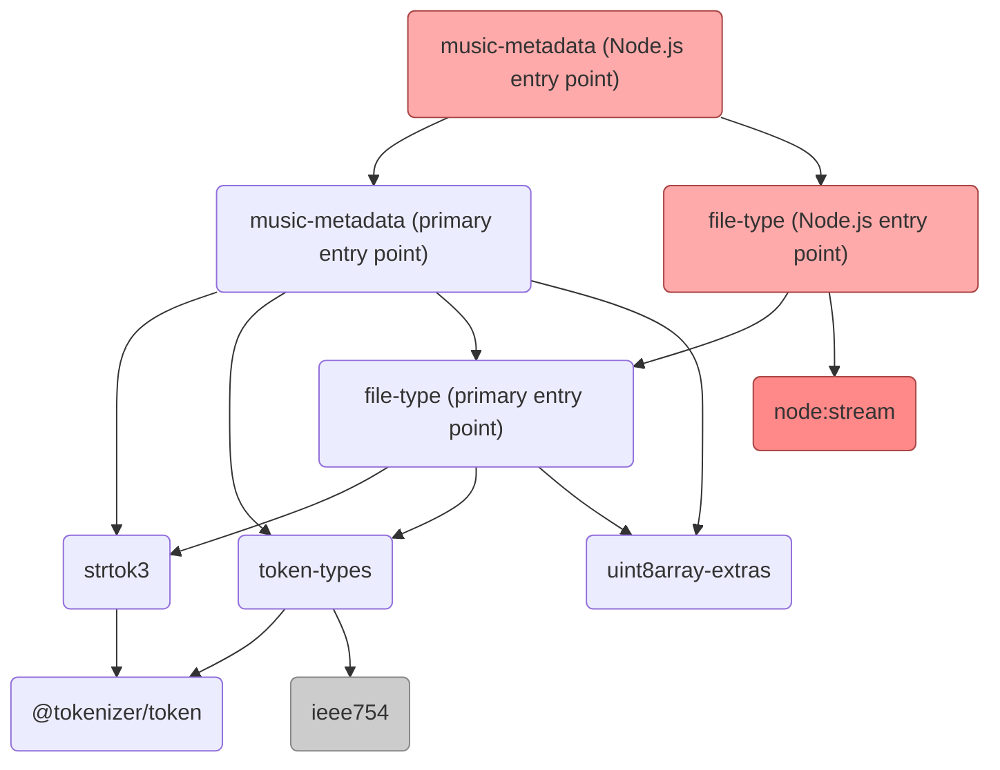

[](https://github.com/Borewit/music-metadata/actions/workflows/ci.yml)
[](https://npmjs.org/package/music-metadata)
[](https://npmcharts.com/compare/music-metadata?start=600&interval=30)
[](https://coveralls.io/github/Borewit/music-metadata?branch=master)
[](https://app.codacy.com/app/Borewit/music-metadata?utm_source=github.com&utm_medium=referral&utm_content=Borewit/music-metadata&utm_campaign=Badge_Grade_Dashboard)
[](https://github.com/Borewit/music-metadata/actions/workflows/codeql-analysis.yml)
[](https://deepscan.io/dashboard#view=project&tid=5165&pid=6938&bid=61821)
[](https://snyk.io/test/github/Borewit/music-metadata?targetFile=package.json)
[](https://discord.gg/KyBr6sb)

# music-metadata

Key features:
- **Comprehensive Format Support**: Supports popular audio formats like MP3, MP4, FLAC, Ogg, WAV, AIFF, and more.
- **Extensive Metadata Extraction**: Extracts detailed metadata, including ID3v1, ID3v2, APE, Vorbis, and iTunes/MP4 tags.
- **Streaming Support**: Efficiently handles large audio files by reading metadata from streams, making it suitable for server-side and browser-based applications.
- **Promise-Based API**: Provides a modern, promise-based API for easy integration into asynchronous workflows.
- **Cross-Platform**: Works in both [Node.js](https://nodejs.org/) and browser environments with the help of bundlers like [Webpack](https://webpack.js.org/) or [Rollup](https://rollupjs.org/introduction/).

The [`music-metadata`](https://github.com/Borewit/music-metadata) module is ideal for developers working on media applications, music players, or any project that requires access to detailed audio file metadata.

## Compatibility

Module: version 8 migrated from [CommonJS](https://en.wikipedia.org/wiki/CommonJS) to [pure ECMAScript Module (ESM)](https://gist.github.com/sindresorhus/a39789f98801d908bbc7ff3ecc99d99c).
The distributed JavaScript codebase is compliant with the [ECMAScript 2020 (11th Edition)](https://en.wikipedia.org/wiki/ECMAScript_version_history#11th_Edition_%E2%80%93_ECMAScript_2020) standard.

> [!NOTE]
> See also [CommonJS backward Compatibility](#commonjs-backward-compatibility)

This module requires a [Node.js ≥ 18](https://nodejs.org/en/about/previous-releases) engine.
It can also be used in a browser environment when bundled with a module bundler.

## Support the Project
If you find this project useful and would like to support its development, consider sponsoring or contributing:

- [Become a sponsor to Borewit](https://github.com/sponsors/Borewit)

- Buy me a coffee:

  <a href="https://www.buymeacoffee.com/borewit" target="_blank"></a>

## Features

### Support for audio file types

| Audio format                                                              | Description                                               | Logo                                                                                             |
|---------------------------------------------------------------------------|-----------------------------------------------------------|--------------------------------------------------------------------------------------------------|
| [AIFF / AIFF-C](https://wikipedia.org/wiki/Audio_Interchange_File_Format) | Audio Interchange File Format                             |      |
| [AAC](https://en.wikipedia.org/wiki/Advanced_Audio_Coding)                | ADTS / Advanced Audio Coding                              |                               |
| [APE](https://wikipedia.org/wiki/Monkey's_Audio)                          | Monkey's Audio                                            |                          |
| [ASF](https://wikipedia.org/wiki/Advanced_Systems_Format)                 | Advanced Systems Format                                   |                                                                                                  |
| [BWF](https://en.wikipedia.org/wiki/Broadcast_Wave_Format)                | Extended WAV format for broadcast and archiving           |                                                                                                  |
| [DSDIFF](https://wikipedia.org/wiki/Direct_Stream_Digital)                | Philips DSDIFF                                            |                                        |
| [DSF](https://wikipedia.org/wiki/Direct_Stream_Digital)                   | Sony's DSD Stream File                                    |                                        |
| [FLAC](https://wikipedia.org/wiki/FLAC)                                   | Free Lossless Audio Codec                                 |                                      |
| [MP2](https://wikipedia.org/wiki/MPEG-1_Audio_Layer_II)                   | MPEG-1 Audio Layer II (predecessor to MP3)                |                                                                                                  |
| [Matroska](https://wikipedia.org/wiki/Matroska)                           | Matroska (EBML), mka, mkv                                 |                         |
| [MP3](https://wikipedia.org/wiki/MP3)                                     | MPEG-1 / MPEG-2 Audio Layer III                           |                                      |
| [MPC](https://wikipedia.org/wiki/Musepack)                                | Musepack SV7                                              |                              |
| [MPEG 4](https://wikipedia.org/wiki/MPEG-4)                               | mp4, m4a, m4v                                             |                            |
| [Ogg](https://en.wikipedia.org/wiki/Ogg)                                  | Open container format                                     |                                        |
| [Opus](https://wikipedia.org/wiki/Opus_(audio_format))                    | Low-latency, high-quality codec for speech and music      |                                      |
| [Speex](https://wikipedia.org/wiki/Speex)                                 | Open-source speech codec optimized for VoIP               |                               |
| [Theora](https://en.wikipedia.org/wiki/Theora)                            | Open video compression format (typically paired with Ogg) |                             |
| [Vorbis](https://wikipedia.org/wiki/Ogg_Vorbis)                           | Vorbis audio compression                                  |                  |
| [WAV](https://wikipedia.org/wiki/WAV)                                     | Uncompressed PCM audio in RIFF container                  |                                                                                                  |
| [WebM](https://wikipedia.org/wiki/WebM)                                   | WebM                                                      |                                  |
| [WV](https://wikipedia.org/wiki/WavPack)                                  | WavPack                                                   |                                |
| [WMA](https://wikipedia.org/wiki/Windows_Media_Audio)                     | Windows Media Audio                                       |  |

### Supported tag headers

Following tag header formats are supported:
- [APE](https://wikipedia.org/wiki/APE_tag)
- [ASF](https://wikipedia.org/wiki/Advanced_Systems_Format)
- EXIF 2.3
- [ID3](https://wikipedia.org/wiki/ID3): ID3v1, ID3v1.1, ID3v2.2, [ID3v2.3](http://id3.org/id3v2.3.0) & [ID3v2.4](http://id3.org/id3v2.4.0-frames)
- [iTunes](https://github.com/sergiomb2/libmp4v2/wiki/iTunesMetadata)
- [RIFF](https://wikipedia.org/wiki/Resource_Interchange_File_Format)/INFO
- [Vorbis comment](https://wikipedia.org/wiki/Vorbis_comment)
- [AIFF](https://wikipedia.org/wiki/Audio_Interchange_File_Format)
 
Following lyric formats are supported:
- [LRC](https://en.wikipedia.org/wiki/LRC_(file_format))
- Synchronized lyrics (SYLT)
- Unsynchronized lyrics (USULT)

Support for [MusicBrainz](https://musicbrainz.org/) tags as written by [Picard](https://picard.musicbrainz.org/).
[ReplayGain](https://wiki.hydrogenaud.io/index.php?title=ReplayGain) tags are supported.

### Audio format & encoding details

Support for encoding / format details:
- [Bit rate](https://wikipedia.org/wiki/Bit_rate)
- [Audio bit depth](https://wikipedia.org/wiki/Audio_bit_depth)
- Duration
- Encoding profile (e.g. [CBR](https://en.wikipedia.org/wiki/Constant_bitrate), V0, V2)


## Online demo's
- [Audio Tag Analyzer](https://audio-tag-analyzer.netlify.app/)
- [ Webamp](https://webamp.org/)
- [ICY Radio Stream Player](https://icy-radio-stream-player.netlify.app/)
- Expected to be released soon: [Overtone](https://overtone.pro/) by [Johannes Schickling](https://github.com/schickling)

## Usage

### Installation
Install using [npm](http://npmjs.org/):

```bash
npm install music-metadata
```
or using [yarn](https://yarnpkg.com/):
```bash
yarn add music-metadata
```

## API Documentation

### Overview

**Node.js specific** functions to read an audio file or stream:
1. **File Parsing**: Parse audio files directly from the filesystem using the [parseFile function](#parsefile-function)
1. **Stream Parsing**: Parse audio metadata from a Node.js [Readable stream](https://nodejs.org/api/stream.html#class-streamreadable) using the [parseStream function](#parsewebstream-function).

**Cross-platform** functions available to read an audio file or stream:

There are multiple ways to parse (read) audio tracks:
1. **Web Stream Parsing**: Parse audio data from a web-compatible [ReadableStream](https://developer.mozilla.org/en-US/docs/Web/API/ReadableStream/ReadableStream) using the [parseWebStream function](#parsewebstream-function).
1. **Blob Parsing**: Parse audio metadata from a (Web API) [Blob](https://developer.mozilla.org/docs/Web/API/Blob) or [File](https://developer.mozilla.org/docs/Web/API/File) using the [parseBlob function](#parseblob-function).
1. **Buffer Parsing**: Parse audio metadata from a [Uint8Array](https://developer.mozilla.org/en-US/docs/Web/JavaScript/Reference/Global_Objects/Uint8Array) or [Buffer](https://nodejs.org/api/buffer.html) using the [parseBuffer function](#parsebuffer-function).
1. **Tokenizer Parsing:** Use a custom or third-party [strtok3](https://github.com/Borewit/strtok3) `ITokenizer` to parse using the [parseFromTokenizer function](#parsefromtokenizer-function).

> [!NOTE]
> Direct file access in Node.js is generally faster because it can 'jump' to various parts of the file without reading intermediate data.

### Node.js specific function
These functions are tailored for Node.js environments and leverage Node.js-specific APIs,
making them incompatible with browser-based JavaScript engines.

#### `parseFile` function

The `parseFile` function is intended for extracting metadata from audio files on the local filesystem in a Node.js environment.
It reads the specified file, parses its audio metadata, and returns a promise that resolves with this information.

##### Syntax
```ts
parseFile(filePath: string, options?: IOptions): Promise<IAudioMetadata>
```

##### Parameters

- `filePath`: `string`

  The path to the media file from which metadata should be extracted.
  This should be a valid path to an audio file on the local filesystem.

- `options`: [IOptions](#ioptions-interface) (optional)

  An optional configuration object that allows customization of the parsing process.
  These options can include whether to calculate the file's duration, skip embedded cover art, 
  or other parsing behaviors.

##### Returns

- `Promise<IAudioMetadata>`: 

  A promise that resolves to an IAudioMetadata object containing metadata about the audio file.
  The metadata includes details such as the file format, codec, duration, bit rate, and any embedded tags like album, artist, or track information.

##### Usage Notes

- This function is **Node.js-only** and relies on Node.js-specific APIs to access the filesystem.

- For browser environments, consider using the [parseBlob](#parseblob-function) to parse [File object](https://developer.mozilla.org/en-US/docs/Web/API/File) objects.

##### Example:

The following example demonstrates how to use the parseFile function to read metadata from an audio file:
```js
import { parseFile } from 'music-metadata';
import { inspect } from 'node:util';

(async () => {
  try {
    const filePath = 'test/samples/MusicBrainz - Beth Hart - Sinner\'s Prayer [id3v2.3].V2.mp3';
    const metadata = await parseFile(filePath);

    // Output the parsed metadata to the console in a readable format
    console.log(inspect(metadata, { showHidden: false, depth: null }));
  } catch (error) {
    console.error('Error parsing metadata:', error.message);
  }
})();
```

#### `parseStream` function

The parseStream function is used to parse metadata from an audio track provided as a Node.js [`Readable`](https://nodejs.org/api/stream.html#class-streamreadable) stream.
This is particularly useful for processing audio data that is being streamed or piped from another source, such as a web server or file system.

##### Syntax:
```ts
parseStream(stream: Readable, fileInfo?: IFileInfo | string, options?: IOptions): Promise<IAudioMetadata>
```

##### Parameters:

- `stream`: `Readable`:
  
  The Node.js [Readable](https://nodejs.org/api/stream.html#class-streamreadable) stream from which the audio data is read.
  This stream should provide the raw audio data to be analyzed.

- `fileInfo`: `IFileInfo` (optional)

  An object containing file-related information or a string representing the MIME-type of the audio stream.
  The fileInfo parameter can help the parser to correctly identify the audio format and may include:

  - `mimeType`: A string representing the [MIME-type](https://developer.mozilla.org/en-US/docs/Web/HTTP/Basics_of_HTTP/MIME_types) (e.g., `audio/mpeg`).
    
    If provided, it is assumed the streamed file content is to be the MIME-type. 
    If not provided, the parser will attempt to determine the format based on the content of the stream.
  
  - `size`: The total size of the audio stream in bytes (useful for streams with a known length).
  
  - `path`: A string representing the file path or filename, which can also assist in determining the format.

- `options`: `IOptions` (optional)
  
  An optional object containing additional parsing options.
  These options allow you to customize the parsing process,
  such as whether to calculate the duration or skip cover art extraction.

##### Returns

- `Promise<IAudioMetadata>`:
 
  A promise that resolves to an `IAudioMetadata` object containing detailed metadata about the audio stream.
  This metadata includes information about the format, codec, duration, bitrate, and any embedded tags such as artist, album, or track information.

##### Usage Notes
- This function is only available in Node.js environments, as it relies on the [Node.js stream API](https://nodejs.org/api/stream.html).

##### Example:

The following example demonstrates how to use the `parseStream` function to read metadata from an audio stream:
```js
import { parseStream } from 'music-metadata';
import { createReadStream } from 'fs';

(async () => {
  try {
    // Create a readable stream from a file
    const audioStream = createReadStream('path/to/audio/file.mp3');

    // Parse the metadata from the stream
    const metadata = await parseStream(audioStream, { mimeType: 'audio/mpeg'});

    // Log the parsed metadata
    console.log(metadata);
  } catch (error) {
    console.error('Error parsing metadata:', error.message);
  }
})();

```

### Cross-platform functions
These functions are designed to be cross-platform,
meaning it can be used in both Node.js and web browsers.

#### `parseWebStream` function

The parseWebStream function is used to extract metadata from an audio track provided as a web-compatible ReadableStream.
This function is ideal for applications running in web environments, such as browsers,
where audio data is streamed over the network or read from other web-based sources.


##### Syntax
```ts
parseWebStream(webStream: ReadableStream<Uint8Array>, fileInfo?: IFileInfo | string, options?: IOptions): Promise<IAudioMetadata>
```

##### Parameters

- `webStream`: `ReadableStream<Uint8Array>`

  A [ReadableStream](https://developer.mozilla.org/en-US/docs/Web/API/ReadableStream/ReadableStream) that provides the audio data to be parsed.
  This stream should emit Uint8Array chunks, representing the raw audio data.

- `fileInfo`: `IFileInfo` (optional)

  An object containing file-related information or a string representing the MIME-type of the audio stream.
  The fileInfo parameter can help the parser to correctly identify the audio format and may include:

    - `mimeType`: A string representing the [MIME-type](https://developer.mozilla.org/en-US/docs/Web/HTTP/Basics_of_HTTP/MIME_types) (e.g., `audio/mpeg`).

      If provided, it is assumed the streamed file content is to be the MIME-type.
      If not provided, the parser will attempt to determine the format based on the content of the stream.

    - `size`: The total size of the audio stream in bytes (useful for streams with a known length).

    - `path`: A string representing the file path or filename, which can also assist in determining the format.

- `options`: `IOptions` (optional)

  An optional object containing additional parsing options.
  These options allow you to customize the parsing process,
  such as whether to calculate the duration or skip cover art extraction.

##### Returns

- `Promise<IAudioMetadata>`:

  A promise that resolves to an `IAudioMetadata` object containing detailed metadata about the audio stream.
  This metadata includes information about the format, codec, duration, bitrate, and any embedded tags such as artist, album, or track information.

##### Example
Here’s an example of how to use the `parseWebStream` function to extract metadata from an audio stream in a web application:

```js
import { parseWebStream } from 'music-metadata';

(async () => {
  try {
    // Fetch the audio file
    const response = await fetch('https://github.com/Borewit/test-audio/raw/refs/heads/master/Various%20Artists%20-%202008%20-%20netBloc%20Vol%2013%20-%20Color%20in%20a%20World%20of%20Monochrome%20%5BAAC-40%5D/1.02.%20Solid%20Ground.m4a');

    // Extract the Content-Length header and convert it to a number
    const contentLength = response.headers.get('Content-Length');
    const size = contentLength ? parseInt(contentLength, 10) : undefined;

    // Parse the metadata from the web stream
    const metadata = await parseWebStream(response.body, {
      mimeType: response.headers.get('Content-Type'),
      size // Important to pass the content-length
    });

    console.log(metadata);
  } catch (error) {
    console.error('Error parsing metadata:', error.message);
  }
})();
```

The example uses the [`fetch` API](https://developer.mozilla.org/en-US/docs/Web/API/Fetch_API) to retrieve an audio file from a URL.
The `response.body` provides a [`ReadableStream`](https://developer.mozilla.org/en-US/docs/Web/API/ReadableStream/ReadableStream) that is then passed to `parseWebStream`.

#### `parseBlob` function

Parses metadata from an audio file represented as a [Blob](https://developer.mozilla.org/en-US/docs/Web/API/Blob). 
This function is suitable for use in environments that support the ReadableStreamBYOBReader, which is **available in Node.js 20** and above.

##### Syntax
```ts
parseBlob(blob: Blob, options?: IOptions = {}): Promise<IAudioMetadata>
```

##### Parameters
 
- `blob`: [Blob](https://developer.mozilla.org/en-US/docs/Web/API/Blob)
  
   The Blob object containing the audio data to be parsed.
   This can be a file or any binary data. If the Blob is an instance of File, its name will be used as the file path in the metadata.

- `options`: [IOptions](#ioptions-interface) (optional)
  
  An optional configuration object that specifies parsing options.

##### Returns 

- `Promise<IAudioMetadata>`:

  A promise that resolves to the metadata of the audio file.

##### Example

```js
import { parseBlob } from 'music-metadata';

(async () => {
  const fileInput = document.querySelector('input[type="file"]');
  const file = fileInput.files[0];
  
  try {
    const metadata = await parseBlob(file);
    console.log(metadata);
  } catch (error) {
    console.error('Error parsing metadata:', error.message);
  }
})();
```

#### `parseBuffer` function

Parses metadata from an audio file where the audio data is held in a [Uint8Array](https://developer.mozilla.org/en-US/docs/Web/JavaScript/Reference/Global_Objects/Uint8Array) or [Buffer](https://nodejs.org/api/buffer.html).
This function is particularly useful when you already have audio data in memory.

##### Syntax
```ts
parseBuffer(buffer: Uint8Array, fileInfo?: IFileInfo | string, opts?: IOptions = {}): Promise<IAudioMetadata>
```

##### Parameters
- `uint8Array`: [Uint8Array](https://developer.mozilla.org/en-US/docs/Web/JavaScript/Reference/Global_Objects/Uint8Array)

  A [Uint8Array](https://developer.mozilla.org/en-US/docs/Web/JavaScript/Reference/Global_Objects/Uint8Array) containing the audio data to be parsed.

- `fileInfo`: `IFileInfo` | `string` (optional)
  
  An object containing file information such as mimeType and size.
  Alternatively, you can pass a MIME-type string directly.
  This helps the parser understand the format of the audio data.

- `options`: [IOptions](#ioptions-interface) (optional)

  An optional configuration object that specifies parsing options.

##### Returns
- `Promise<IAudioMetadata>`:
  
  A promise that resolves to the metadata of the audio file.


##### Example

```js
import { parseBuffer } from 'music-metadata';
import fs from 'fs';

(async () => {
  const buffer = fs.readFileSync('path/to/audio/file.mp3');

  try {
    const metadata = await parseBuffer(buffer, { mimeType: 'audio/mpeg' });
    console.log(metadata);
  } catch (error) {
    console.error('Error parsing metadata:', error.message);
  }
})();
```

#### `parseFromTokenizer` function
Parses metadata from an audio source that implements the [strtok3](https://github.com/Borewit/strtok3) ITokenizer interface.
This is a low-level function that provides flexibility for advanced use cases,
such as parsing metadata from streaming audio or custom data sources.

This also enables special read modules like:
- [streaming-http-token-reader](https://github.com/Borewit/streaming-http-token-reader) for chunked HTTP(S) reading, using [HTTP range requests](https://developer.mozilla.org/en-US/docs/Web/HTTP/Range_requests).

##### Syntax
```ts
parseFromTokenizer(tokenizer: ITokenizer, options?: IOptions): Promise<IAudioMetadata>
```

##### Parameters
- `tokenizer: ITokenizer`

  An instance of an ITokenizer that provides access to the audio data.
  The tokenizer abstracts the reading process, enabling support for various types of sources, including streams, buffers, or custom data readers.

- `options`: [IOptions](#ioptions-interface) (optional)

  An optional configuration object that specifies parsing options.

##### Returns
- `Promise<IAudioMetadata>`:

  A promise that resolves to the metadata of the audio source, including information like the title, artist, album, and more.


##### Example
````js
import { fromNodeProviderChain } from '@aws-sdk/credential-providers';
import { S3Client } from '@aws-sdk/client-s3';
import { makeTokenizer } from '@tokenizer/s3';
import { parseFromTokenizer as mmParseFromTokenizer } from 'music-metadata';

// Configure the S3 client
const s3 = new S3Client({
  region: 'eu-west-2',
  credentials: fromNodeProviderChain(),
});

// Helper function to create a tokenizer for S3 objects
async function makeS3TestDataTokenizer(key, options) {
  return await makeTokenizer(s3, {
    Bucket: 'music-metadata',
    Key: key,
  }, options);
}

// Function to read and log metadata from an S3 object
async function readMetadata() {
  try {
    // Create a tokenizer for the specified S3 object
    const tokenizer = await makeS3TestDataTokenizer('path/to/audio/file.mp3', { disableChunked: false });

    // Parse the metadata from the tokenizer
    const metadata = await mmParseFromTokenizer(tokenizer);

    // Log the retrieved metadata
    console.log(metadata);
  } catch (error) {
    console.error('Error parsing metadata:', error.message);
  }
}

// Execute the metadata reading function
readMetadata();
````
##### Additional Resources
- [strtok3](https://github.com/Borewit/strtok3) - Learn more about the `ITokenizer` interface and how to implement it for various use cases.
- [AWS SDK for JavaScript](https://aws.amazon.com/sdk-for-javascript/) - Documentation on using the AWS SDK to interact with S3 and other AWS services.
- [@tokenizer/s3](https://github.com/Borewit/tokenizer-s3) - Example of `ITokenizer` implementation.

### Handling Parse Errors

`music-metadata` provides a robust and extensible error handling system with custom error classes that inherit from the standard JavaScript `Error`.
All possible parsing errors are part of a union type `UnionOfParseErrors`, ensuring that every error scenario is accounted for in your code.

#### Union of Parse Errors 

All parsing errors extend from the base class `ParseError` and are included in the `UnionOfParseErrors` type:
```ts
export type UnionOfParseErrors =
  | CouldNotDetermineFileTypeError
  | UnsupportedFileTypeError
  | UnexpectedFileContentError
  | FieldDecodingError
  | InternalParserError;
```

#### Error Types
 
- `CouldNotDetermineFileTypeError`: Raised when the file type cannot be determined.
- `UnsupportedFileTypeError`: Raised when an unsupported file type is encountered.
- `UnexpectedFileContentError`: Raised when the file content does not match the expected format.
- `FieldDecodingError`: Raised when a specific field in the file cannot be decoded.
- `InternalParserError`: Raised for internal parser errors.

### Other functions

#### `orderTags` function

Utility to Converts the native tags to a dictionary index on the tag identifier

```ts
orderTags(nativeTags: ITag[]): [tagId: string]: any[]
```

```js
import { parseFile, orderTags } from 'music-metadata';
import { inspect } from 'util';

(async () => {
  try {
    const metadata = await parseFile('../test/samples/MusicBrainz - Beth Hart - Sinner\'s Prayer [id3v2.3].V2.mp3');
    const orderedTags = orderTags(metadata.native['ID3v2.3']);
    console.log(inspect(orderedTags, { showHidden: false, depth: null }));
  } catch (error) {
    console.error(error.message);
  }
})();
```

#### `ratingToStars` function

   Can be used to convert the normalized rating value to the 0..5 stars, where 0 an undefined rating, 1 the star the lowest rating and 5 the highest rating.

   ```ts
   ratingToStars(rating: number): number
   ```
#### `selectCover` function

Select cover image based on image type field, otherwise the first picture in file.

```ts
export function selectCover(pictures?: IPicture[]): IPicture | null
```

```js
import { parseFile, selectCover } from 'music-metadata';

(async () => {
  const {common} = await parseFile(filePath);
  const cover = selectCover(common.picture); // pick the cover image
}
)();
 ```

#### `getSupportedMimeTypes` function

Returns a list of supported MIME-types. This may include some MIME-types which are not formally recognized.

### `IOptions` Interface
- `duration`: `boolean` (default: `false`)

  When `true`, the parser will read the entire media file _if necessary_ to determine the duration.
  This is only applicable in cases where duration cannot be reliably inferred without full file analysis.
  Note that enabling this option **does not guarantee** that duration will be available,
  only that the parser will attempt to calculate it when possible, even if it requires reading the full file.

- `mkvUseIndex`: `boolean` (default: `false`)

  When `true`, the parser uses the SeekHead index in Matroska (MKV) files to skip segment and cluster elements.
  This experimental feature can improve performance, but:
  - Metadata not listed in the SeekHead may be skipped.
  - If the SeekHead is missing, this option has no effect.

- `observer`: `(update: MetadataEvent) => void;`:

  Callback function triggered when common tags or format properties are updated during parsing.
  Allows real-time monitoring of metadata as it becomes available.
 
- `skipCovers`: `boolean` (default: `false`)

  When `true`, embedded cover art (images) will not be extracted.
  Useful for reducing memory and processing when cover images are unnecessary.
 
- `skipPostHeaders`: `boolean` (default: `false`)
  When `true`, tag headers located at the end of the file will not be read.
  This is particularly beneficial for streaming input, as it avoids the need to read the entire stream.

> [!NOTE]
> - The `duration` option is typically included in most cases, but setting it to true ensures that the entire file is parsed if necessary to get an accurate duration.
> - Using `mkvUseIndex` can improve performance in Matroska files, but be aware of potential side effects, such as missing metadata due to skipped elements.


### `IAudioMetadata` interface

If the returned promise resolves, the metadata (TypeScript `IAudioMetadata` interface) contains:
- [`metadata.format`](#metadataformat) Audio format information
- [`metadata.common`](#metadatacommon) Is a generic (abstract) way of reading metadata information.
- [`metadata.trackInfo`](#metadatatrackInfo) Is a generic (abstract) way of reading metadata information.
- `metadata.native` List of native (original) tags found in the parsed audio file.

#### `metadata.format`

The questionmark `?` indicates the property is optional.

Audio format information. Defined in the TypeScript `IFormat` interface:
- `format.container?: string` Audio encoding format. e.g.: 'flac'
- `format.codec?` Name of the codec (algorithm used for the audio compression)
- `format.codecProfile?: string` Codec profile / settings
- `format.tagTypes?: TagType[]`  List of tagging formats found in parsed audio file
- `format.duration?: number` Duration in seconds
- `format.bitrate?: number` Number bits per second of encoded audio file
- `format.sampleRate?: number` Sampling rate in Samples per second (S/s)
- `format.bitsPerSample?: number` Audio bit depth
- `format.lossless?: boolean` True if lossless,  false for lossy encoding
- `format.numberOfChannels?: number` Number of audio channels
- `format.creationTime?: Date` Track creation time
- `format.modificationTime?: Date` Track modification / tag update time
- `format.trackGain?: number` Track gain in dB
- `format.albumGain?: number` Album gain in dB

#### `metadata.trackInfo`

To support advanced containers like [Matroska](https://wikipedia.org/wiki/Matroska) or [MPEG-4](https://en.wikipedia.org/wiki/MPEG-4), which may contain multiple audio and video tracks, the **experimental**- `metadata.trackInfo` has been added,

`metadata.trackInfo` is either `undefined` or has an **array** of [trackInfo](#trackinfo)

##### trackInfo

Audio format information. Defined in the TypeScript `IFormat` interface:
- `trackInfo.type?: TrackType` Track type
- `trackInfo.codecName?: string` Codec name
- `trackInfo.codecSettings?: string` Codec settings
- `trackInfo.flagEnabled?: boolean` Set if the track is usable, default: `true`
- `trackInfo.flagDefault?: boolean` Set if that track (audio, video or subs) SHOULD be active if no language found matches the user preference.
- `trackInfo.flagLacing?: boolean` Set if the track **may** contain blocks using lacing
- `trackInfo.name?: string` A human-readable track name.
- `trackInfo.language?: string` Specifies the language of the track
- `trackInfo.audio?: IAudioTrack`, see [`trackInfo.audioTrack`](#trackinfoaudiotrack)
- `trackInfo.video?: IVideoTrack`, see [`trackInfo.videoTrack`](#trackinfovideotrack)

##### `trackInfo.audioTrack`

- `audioTrack.samplingFrequency?: number`
- `audioTrack.outputSamplingFrequency?: number`
- `audioTrack.channels?: number`
- `audioTrack.channelPositions?: Buffer`
- `audioTrack.bitDepth?: number`

##### `trackInfo.videoTrack`

- `videoTrack.flagInterlaced?: boolean`
- `videoTrack.stereoMode?: number`
- `videoTrack.pixelWidth?: number`
- `videoTrack.pixelHeight?: number`
- `videoTrack.displayWidth?: number`
- `videoTrack.displayHeight?: number`
- `videoTrack.displayUnit?: number`
- `videoTrack.aspectRatioType?: number`
- `videoTrack.colourSpace?: Buffer`
- `videoTrack.gammaValue?: number`

#### `metadata.common`

[Common tag documentation](doc/common_metadata.md) is automatically generated.

## Examples

In order to read the duration of a stream (with the exception of file streams), in some cases you should pass the size of the file in bytes.
```js
import { parseStream } from 'music-metadata';
import { inspect } from 'util';

(async () => {
    const metadata = await parseStream(someReadStream, {mimeType: 'audio/mpeg', size: 26838}, {duration: true});
    console.log(inspect(metadata, {showHidden: false, depth: null}));
    someReadStream.close();
  }
)();
```

### Access cover art

Via `metadata.common.picture` you can access an array of cover art if present.
Each picture has this interface:

```ts
/**
 * Attached picture, typically used for cover art
 */
export interface IPicture {
  /**
   * Image mime type
   */
  format: string;
  /**
   * Image data
   */
  data: Buffer;
  /**
   * Optional description
   */
  description?: string;
  /**
   * Picture type
   */
  type?: string;
}
```

To assign `img` HTML-object you can do something like:
```js
import {uint8ArrayToBase64} from 'uint8array-extras';

img.src = `data:${picture.format};base64,${uint8ArrayToBase64(picture.data)}`;
```

## Dependencies

Dependency diagram:


Dependency list:
- [tokenizer-token](https://github.com/Borewit/tokenizer-token)
- [strtok3](https://github.com/Borewit/strtok3)
- [token-types](https://github.com/Borewit/token-types)
- [file-type](https://github.com/sindresorhus/file-type)
- [@tokenizer-token](https://github.com/Borewit/tokenizer-token)

## CommonJS backward compatibility

Using Node.js ≥ 22, which is support loading ESM module via require 
```js
const mm = require('music-metadata');
```

For older Node.js version < 22, you need to dynamically import **music-metadata**:
```js
(async () => {
  // Dynamically loads the ESM module in a CommonJS project
  const mm = await import('music-metadata');
})();
```

For CommonJS TypeScript projects, I recommend to avoid using `commonjs` for the TypeScript compiler `module` option, 
and either use `node16` or `nodenext`, which enable utilizing [dynamic import](https://developer.mozilla.org/docs/Web/JavaScript/Reference/Operators/import).

If you do want to use the classic `commonjs` option, this is how you can get the _dynamic import_ to work.

```js
import {loadEsm} from 'load-esm';

(async () => {
  // Dynamically loads the ESM module in a CommonJS project
  const mm = await loadEsm<typeof import('music-metadata')>('music-metadata');
})();
```

When you use Node.js version ≥ 22, which supports loading ESM modules via require, this compensates for that issue.

## Frequently Asked Questions

###  How can I traverse (a long) list of files?

What is important that file parsing should be done in a sequential manner.
In a plain loop, due to the asynchronous character (like most JavaScript functions), it would cause all the files to run in parallel which is will cause your application to hang in no time.
There are multiple ways of achieving this:

1.  Using recursion

    ```js
    import { parseFile } from 'music-metadata';

    function parseFiles(audioFiles) {

      const audioFile = audioFiles.shift();

      if (audioFile) {
        return parseFile(audioFile).then(metadata => {
          // Do great things with the metadata
          return parseFiles(audioFiles); // process rest of the files AFTER we are finished
        })
      }
    }

    ```

1. Use async/await

   Use [async/await](https://javascript.info/async-await)

   ```js
   import { parseFile } from 'music-metadata';

   // it is required to declare the function 'async' to allow the use of await
   async function parseFiles(audioFiles) {

       for (const audioFile of audioFiles) {

           // await will ensure the metadata parsing is completed before we move on to the next file
           const metadata = await parseFile(audioFile);
           // Do great things with the metadata
       }
   }
   ```

### Using music-metadata with TypeScript and module-resolution set to bundler.

If the TypeScript compiler option [`moduleResolution`](https://www.typescriptlang.org/tsconfig/#moduleResolution)
is set to `"bundler"`, it does not set the ECMAScript `"node"` condition, causing the Node specific function fail to import.

This is the case using Next.js. See [issue #2370](https://github.com/Borewit/music-metadata/issues/2370) how to resolve that.

## Licence

This project is licensed under the [MIT License](LICENSE.txt). Feel free to use, modify, and distribute as needed.
